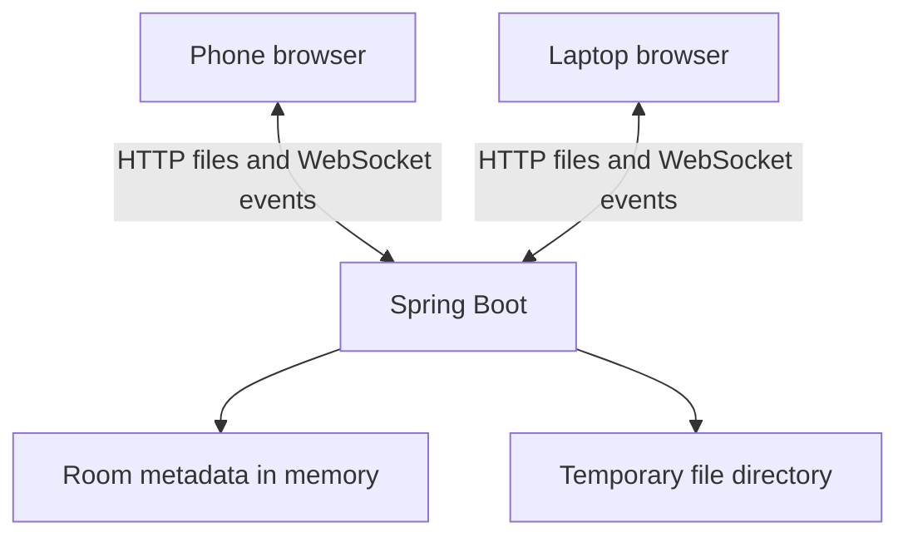

# DropLink

Temporary file sharing between phone and laptop, without cluttering a chat.

**Status: Day 1 of 8 — setup and architecture.** This build checks the backend
connection. It does not create rooms or transfer files yet. Deployment is planned
for September 28, 2026, after the earlier milestones are completed.

## Problem

Using WhatsApp to move files between your own devices mixes transfers with messages,
makes old files hard to find, and leaves a history you may not need.

## Solution

The intended MVP creates a temporary room. Another device joins by code or QR link.
Either device can upload a file and the other can download it. The server expires
the room and deletes its temporary files. No account is planned for the MVP.

## Features

| Feature | Current status |
| --- | --- |
| Responsive React workspace | Implemented |
| Spring Boot health API and connection check | Implemented |
| Loading, failure, retry, and timeout states | Implemented |
| Room creation, joining, and expiry | Planned: September 22 |
| QR codes and join links | Planned: September 23 |
| PDFs, documents, images, ZIPs, and code files | Planned: September 24 |
| Bidirectional sharing and live updates | Planned: September 25 |
| UX polish | Planned: September 26 |
| Broader tests and cleanup | Planned: September 27 |
| Deployment, final README, and screenshots | Planned: September 28 |

## Tech stack

- Frontend: React 19.3.0, Vite 8.3.0, JavaScript, CSS.
- Backend: Spring Boot 4.1.1, Java 17 language target, Maven Wrapper 3.9.16.
- Real-time: Spring WebSocket dependency installed; endpoint comes on Day 5.
- Planned storage: in-memory room metadata and a server-local temporary directory.
- Tests: Node's built-in test runner and JUnit/Spring Boot integration tests.

JavaScript is intentional: there is no extra TypeScript learning requirement on Day 1.
No database, Docker, accounts, or cloud services are needed to run this checkpoint.

## Architecture

Current request path: browser → Vite development proxy → Spring Boot health controller.
The browser requests `/api/health`. Vite forwards that request to port 8080. Spring
returns JSON; React uses it to display connection status. This checks reachability,
not file storage or any future sharing feature.

Planned MVP:



HTTP carries files. WebSockets carry small notifications, such as “a file is ready.”
The server mediates transfers; this is not peer-to-peer or end-to-end encrypted.
See [architecture decisions](docs/architecture.md) for the privacy and expiry design.

## Setup

Install a JDK (17 or later; 21/25 LTS are also suitable), Node.js 22.12+ or 24+,
and Git. Java 26 is compatible with this Spring Boot version. Set `JAVA_HOME` to
your JDK directory if the wrapper cannot find Java. Internet is required on the
first run to download Maven and dependencies. IntelliJ is optional.

Check your environment:

```powershell
java -version
node --version
npm --version
git --version
```

Extract the project, open a terminal inside `droplink`, and start the backend:

```powershell
cd backend
.\mvnw.cmd spring-boot:run
```

In a **second** terminal, again starting inside `droplink`:

```powershell
cd frontend
npm ci
npm run dev
```

Open [localhost:5173](http://localhost:5173) and press **Check connection**.
Expect **Server is reachable**. Keep both terminals open. Stop a server with Ctrl+C.

On macOS/Linux use `./mvnw` wherever these instructions use `.\mvnw.cmd`.
If necessary run `chmod +x mvnw` once inside `backend` after extracting the ZIP.

Optional configuration: copy `frontend/.env.example` to `frontend/.env` to change
the proxy target. Defaults work without an environment file. Restart Vite after
changing it. The backend understands `PORT` (default 8080) and `SERVER_ADDRESS`
(default 127.0.0.1). These are process environment variables; Spring Boot does not
automatically read a `.env` file.

## Test and build

Inside `backend`:

```powershell
.\mvnw.cmd test
.\mvnw.cmd package
```

Inside `frontend`:

```powershell
npm test
npm run build
```

Backend packaging creates `backend/target/droplink-0.1.0-SNAPSHOT.jar`. Frontend
building creates `frontend/dist/`. Neither output should be committed.
`vite preview` only previews static output: it is not the configured development
API proxy and is not a production deployment. For Day 1 use `npm run dev`.

For manual success/failure checks, phone access, IntelliJ breakpoints, and common
errors, follow [the Day 1 lesson](docs/day-01.md). See
[recorded verification](docs/verification-day-01.md) for checks actually run.

## What I learned

Day 1 learning notes to review by tracing the running application:

- A frontend presents data; the backend controls the API and will enforce room rules.
- An HTTP request reaches a Java controller and returns a JSON response.
- React state controls loading, success, and error messages.
- A Vite proxy gives the browser one local origin during development.
- A Maven Wrapper and npm lockfile make setup more reproducible.
- A successful build, an API test, and a browser check prove different things.

This project is being built with AI assistance. These notes describe lesson topics,
not a claim that I independently wrote or mastered every component. I will add my
own explanations and real debugging lessons after each day.

## Future work

Complete the remaining MVP milestones first. Only then consider transfer progress,
resumable uploads, end-to-end encryption, or storage shared by multiple backend
instances. There is no need for these extras in the first build.

## GitHub

Repository: [shaileshsalve-7/droplink](https://github.com/shaileshsalve-7/droplink).

Clone the project to start from the GitHub history:

```powershell
git clone https://github.com/shaileshsalve-7/droplink.git
cd droplink
```

Daily commands and the implementation commit message are in [Day 1](docs/day-01.md).
The earlier downloadable Git bundle is an offline checkpoint; use a fresh GitHub
clone for future work so your local history matches the published repository.

## References

- [Spring Boot system requirements](https://docs.spring.io/spring-boot/system-requirements.html)
- [Vite setup guide](https://vite.dev/guide/)
- [React learning guide](https://react.dev/learn)
- [Spring Initializr](https://start.spring.io/) — official Maven Wrapper scaffold.
