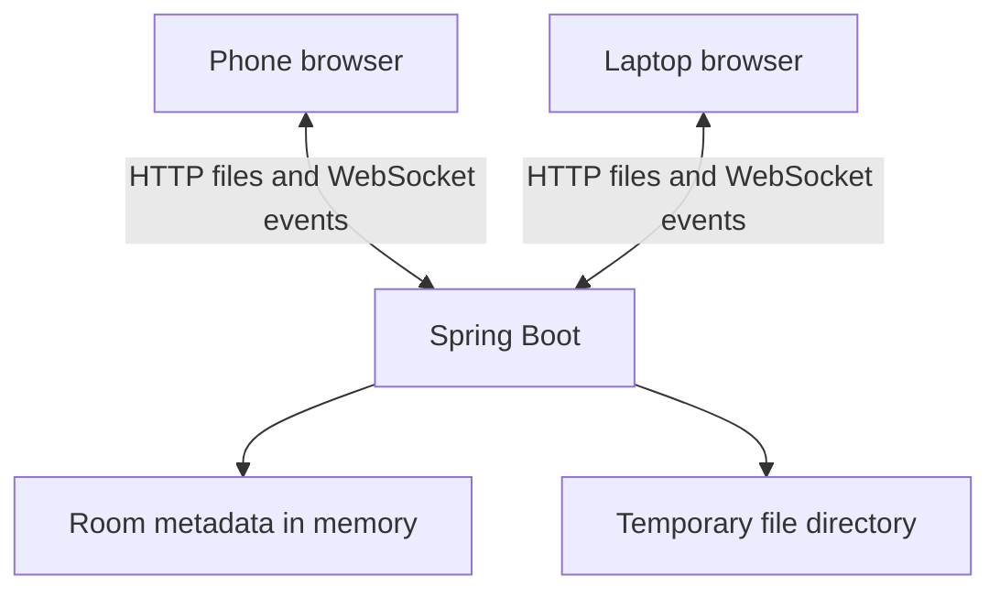

# DropLink

Temporary file sharing between phone and laptop, without cluttering a chat.

**Status: Day 4 of 8 — file uploads and temporary storage.** Create a room,
connect by code, QR, or link, then upload and download files in either direction.
Use **Refresh files** on the receiving device; automatic updates arrive on Day 5.
Rooms expire after 30 minutes by default. Deployment is planned for September 28, 2026.

## Problem

Using WhatsApp to move files between your own devices mixes transfers with messages,
makes old files hard to find, and leaves a history you may not need.

## Solution

The intended MVP creates a temporary room. Another device joins by code or QR link.
Either device can upload a file and the other can download it. The server expires
the room and deletes its temporary files. No account is planned for the MVP.

## Features

| Feature | Current status |
| --- | --- |
| Responsive React workspace | Implemented |
| Spring Boot health API and connection check | Implemented |
| Loading, failure, retry, and timeout states | Implemented |
| Room creation, joining, expiry, and leaving | Implemented |
| Member access tokens, room/member caps, and admission throttling | Implemented |
| Tab session recovery and manual room status refresh | Implemented |
| Locally generated QR invitations and join links | Implemented |
| PDFs, documents, images, ZIPs, and code files | Implemented: upload/list/download |
| Bidirectional sharing with manual file refresh | Implemented |
| WebSocket live updates | Planned: September 25 |
| UX polish | Planned: September 26 |
| Broader tests and cleanup | Planned: September 27 |
| Deployment, final README, and screenshots | Planned: September 28 |

## Tech stack

- Frontend: React 19.3.0, Vite 8.3.0, JavaScript, CSS, qrcode.react 4.2.0.
- Backend: Spring Boot 4.1.1, Java 17 language target, Maven Wrapper 3.9.16.
- Real-time: Spring WebSocket dependency installed; endpoint comes on Day 5.
- Storage: in-memory room metadata implemented; server-local temporary file storage implemented.
- Tests: Node's test runner, Vitest/Testing Library with jsdom, and JUnit/Spring Boot tests.

JavaScript is intentional: there is no extra TypeScript learning requirement on Day 1.
No database, Docker, accounts, or cloud services are needed to run this checkpoint.

## Architecture

Current request path: browser → Vite development proxy → Spring Boot controllers → room service.
The browser requests `/api/health`. Vite forwards that request to port 8080. Spring
returns JSON; React uses it to display connection status. This checks reachability. Room requests use `/api/rooms`; their service stores
bounded, temporary metadata in memory and checks member credentials and expiry.
File requests use `/api/rooms/{id}/files`; a separate storage service streams
uploads to disk and returns metadata only after a successful copy and access recheck.

Planned MVP:



HTTP carries files. WebSockets carry small notifications, such as “a file is ready.”
The server mediates transfers; this is not peer-to-peer or end-to-end encrypted.
See [architecture decisions](docs/architecture.md) for the privacy and expiry design.

## Setup

Install a JDK (17 or later; 21/25 LTS are also suitable), Node.js 22.12+ or 24+,
and Git. Java 26 is compatible with this Spring Boot version. Set `JAVA_HOME` to
your JDK directory if the wrapper cannot find Java. Internet is required on the
first run to download Maven and dependencies. IntelliJ is optional.

Check your environment:

```powershell
java -version
node --version
npm --version
git --version
```

Extract the project, open a terminal inside `droplink`, and start the backend:

```powershell
cd backend
.\mvnw.cmd spring-boot:run
```

In a **second** terminal, again starting inside `droplink`:

```powershell
cd frontend
npm ci
npm run dev
```

Open [localhost:5173](http://localhost:5173), press **Create room**, then join using
the code from a separate browser or device. Press **Refresh status** to see joined
sessions. Keep both terminals open. Stop a server with Ctrl+C. The health check
remains available under **Check server connection**.

On macOS/Linux use `./mvnw` wherever these instructions use `.\mvnw.cmd`.
If necessary run `chmod +x mvnw` once inside `backend` after extracting the ZIP.

Optional configuration: copy `frontend/.env.example` to `frontend/.env` to change
the proxy target. Defaults work without an environment file. Restart Vite after
changing it. The backend understands `PORT` (default 8080) and `SERVER_ADDRESS`
(default 127.0.0.1). These are process environment variables; Spring Boot does not
automatically read a `.env` file.

## Test and build

Inside `backend`:

```powershell
.\mvnw.cmd test
.\mvnw.cmd package
```

Inside `frontend`:

```powershell
npm test
npm run build
```

Backend packaging creates `backend/target/droplink-0.1.0-SNAPSHOT.jar`. Frontend
building creates `frontend/dist/`. Neither output should be committed.
`vite preview` only previews static output: it is not the configured development
API proxy and is not a production deployment. For local development use `npm run dev`.

For manual success/failure checks, phone access, IntelliJ breakpoints, and common
errors, follow [the Day 1 lesson](docs/day-01.md). See
[Day 1 verification](docs/verification-day-01.md) for its recorded checks.

Follow [the Day 2 lesson](docs/day-02.md) for room behavior, API details, tests,
debugging, and Git commands. [Day 2 verification](docs/verification-day-02.md) records
what passed and what still needs manual browser/device checks. After packaging,
run `node scripts/smoke-day2.mjs` from the repository root for the live API smoke test.

Follow [Day 3](docs/day-03.md) for QR/link behavior, phone setup, tests, and debugging.
[Day 3 verification](docs/verification-day-03.md) distinguishes automated checks
from pending physical camera/browser checks. For phone invitations, start Vite
with `npm run dev -- --host 0.0.0.0` and open the laptop's LAN address on the laptop
itself before creating a room. Localhost URLs deliberately do not produce a QR.

Rooms default to 30 minutes (`ROOM_TTL`, e.g. `PT10S` for a local expiry check),
100 active rooms, and eight members per room. Joining never extends expiry. Tokens
are stored in tab session storage; treat codes and tokens as secrets. Status counts
joined sessions, not online devices. Use one backend instance; restart clears rooms.
Anyone with a code can join. The server can read uploads; this is not
end-to-end encryption. Do not deploy this development checkpoint publicly yet.

Day 4 supports any non-empty file type, up to **10 MiB per file**, **20 files / 50 MiB
per room**, and **250 MiB of stored files per server**. Files are downloads, never
inline previews. Uploads and downloads use member tokens in headers. Expiry blocks
new access immediately; disk cleanup runs every 30 seconds and retries failures.
An already-started download can finish after expiry. This is temporary sharing,
not a backup service.

The default storage folder is `droplink-files` inside Java's temporary directory.
`DROPLINK_STORAGE_DIR` can select a dedicated app-only folder. Never point it at a
folder containing your personal files. One process holds a lock; startup removes
old generated blobs because the old rooms no longer exist. Normal shutdown also
removes blobs. A hard crash leaves them until the next startup cleanup.
Multipart request spooling has separate bounded overhead (four uploads, 11 MiB
request limit); the 250 MiB quota applies to stored blobs. OS/container temporary
spools after a hard crash may require system cleanup.

Follow [Day 4](docs/day-04.md) for the code explanation, API, run/test/debug steps,
Git commands, and GitHub summary. [Day 4 verification](docs/verification-day-04.md)
records the checks and remaining physical-device work. After packaging, run
`node scripts/smoke-day4.mjs` from the repository root for live two-session transfer,
expiry, disk cleanup, and crash/restart checks.

## What I learned

Day 1 learning notes to review by tracing the running application:

- A frontend presents data; the backend controls the API and will enforce room rules.
- An HTTP request reaches a Java controller and returns a JSON response.
- React state controls loading, success, and error messages.
- A Vite proxy gives the browser one local origin during development.
- A Maven Wrapper and npm lockfile make setup more reproducible.
- A successful build, an API test, and a browser check prove different things.

Day 2 adds these learning topics:

- A join code admits a session; its bearer token authorizes later requests.
- Checking expiry on access prevents a late cleanup task from extending access.
- Synchronization keeps concurrent capacity checks and inserts consistent.
- A saved browser session must be revalidated after reload or backend restart.
- Simulated DOM tests, HTTP tests, and real-device checks prove different things.

Day 3 adds these learning topics:

- A QR code encodes a join URL, not a file or a member access token.
- URL fragments stay out of the initial HTTP request but are not encrypted.
- Explicit joining prevents page opening from creating duplicate memberships.
- A valid QR payload and a reachable network address are separate requirements.

Day 4 adds these learning topics:

- Multipart requests carry file bytes; JSON carries file metadata.
- A random storage ID prevents a filename from becoming a server path.
- Streaming copies bound memory use; atomic quota checks prevent concurrent overflow.
- Authorization before parsing saves resources; rechecking after copying handles expiry.
- HTTP access expiry and physical disk deletion are separate events.
- File uploads cannot be blindly retried after a network interruption.

This project is being built with AI assistance. These notes describe lesson topics,
not a claim that I independently wrote or mastered every component. I will add my
own explanations and real debugging lessons after each day.

## Future work

Complete the remaining MVP milestones first. Only then consider transfer progress,
resumable uploads, end-to-end encryption, or storage shared by multiple backend
instances. There is no need for these extras in the first build.

## GitHub

Repository: [shaileshsalve-7/droplink](https://github.com/shaileshsalve-7/droplink).

Clone the project to start from the GitHub history:

```powershell
git clone https://github.com/shaileshsalve-7/droplink.git
cd droplink
```

Daily commands and implementation commit messages are in [Day 1](docs/day-01.md)
[Day 2](docs/day-02.md), [Day 3](docs/day-03.md), and [Day 4](docs/day-04.md).
The earlier downloadable Git bundle is an offline checkpoint; use a fresh GitHub
clone for future work so your local history matches the published repository.

## References

- [Spring Boot system requirements](https://docs.spring.io/spring-boot/system-requirements.html)
- [Vite setup guide](https://vite.dev/guide/)
- [React learning guide](https://react.dev/learn)
- [Spring Initializr](https://start.spring.io/) — official Maven Wrapper scaffold.

- [Spring file upload guide](https://spring.io/guides/gs/uploading-files/)
