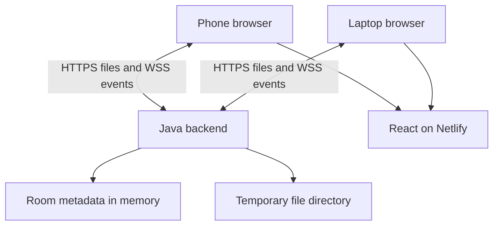
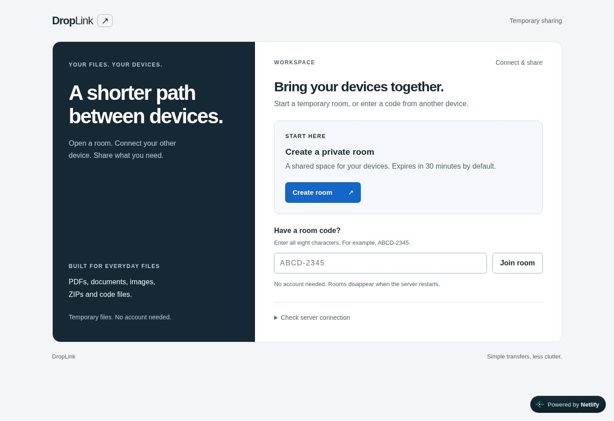

# DropLink

Temporary file sharing between phone and laptop, without cluttering a chat.

**Live frontend:** [droplink-shailesh.netlify.app](https://droplink-shailesh.netlify.app/)

**Status:** The frontend is deployed on Netlify. The Java backend still needs
deployment, so public room creation, joining, uploads and downloads are not yet
available. The sharing MVP and Netlify integration are implemented and tested
locally. See [release verification](docs/verification-release.md) for completed
checks and remaining deployment work.

## Problem and solution

Sending files to yourself through WhatsApp mixes transfers with conversations and
leaves a history you may not need. DropLink creates a temporary room instead:
open it on one device, join from another using a code, QR, or link, and transfer
files in either direction. No account is required.

## Features

- Eight-character room codes, QR invitations, and copyable join links.
- Thirty-minute maximum room lifetime, with separate member access tokens.
- Upload/download of PDFs, documents, images, ZIPs, and code files.
- Automatic file-list updates, reconnect recovery, and manual refresh fallback.
- File selection feedback, clear error states, and compact invitation controls.
- Bounded storage and request handling, room isolation, and temporary-file cleanup.
- Session recovery within a browser tab; leave revokes that session's access.

| Limit | Default |
| --- | --- |
| File size | 10 MiB, non-empty files |
| Files / storage per room | 20 files / 50 MiB |
| Stored files per server | 250 MiB |
| Active rooms / members per room | 100 / 8 |
| Concurrent upload parsing | 4 requests, up to 11 MiB each |

## Tech stack

| Layer | Technology |
| --- | --- |
| Interface | React 19.3, Vite 8.3, JavaScript, CSS, qrcode.react |
| Server | Spring Boot 4.1.1, Java 17 target, Maven Wrapper |
| Transport | HTTP multipart uploads/downloads; native WebSocket notifications |
| Storage | In-memory room metadata and dedicated server-local temporary files |
| Tests | Node test runner, Vitest/Testing Library/jsdom, JUnit/Spring HTTP tests |
| Hosting configuration | Netlify frontend; Java Docker backend on free Render compute |

## Architecture



During development Vite proxies `/api` to Spring Boot. On Netlify the built React assets call the separate Java backend over HTTPS/WSS.
An optional single-JAR deployment still bundles the frontend with Spring Boot. HTTP carries file bytes;
WebSockets carry small notifications that trigger a fresh file-list request.
Tokens stay out of invitation URLs and WebSocket handshake URLs. The backend
allows only the configured frontend origin for cross-origin browser requests.

This is server-mediated sharing, not peer-to-peer or end-to-end encryption.
Anyone with the room code can join, and the server can read uploaded bytes.
See [architecture decisions](docs/architecture.md) and [deployment](docs/deployment.md).

## Local setup

Install Git, a JDK 17 or later, and Node.js 22.12+ or 24+. Set `JAVA_HOME` if the
Maven wrapper cannot find Java. The first install needs internet access.

```powershell
git clone https://github.com/shaileshsalve-7/droplink.git
cd droplink
java -version
node --version
```

Terminal 1, from the project root:

```powershell
cd backend
.\mvnw.cmd spring-boot:run
```

Terminal 2, from the project root:

```powershell
cd frontend
npm ci
npm run dev
```

Open http://localhost:5173. Create a room, then join from a separate browser or
device. Keep both terminals open; Ctrl+C stops each server. On Linux/macOS use
`./mvnw` instead of `.\mvnw.cmd`.

For a phone on the same Wi-Fi, start Vite with `npm run dev -- --host 0.0.0.0` and
open the laptop's LAN address, such as `http://<laptop-LAN-IP>:5173`, on **both**
devices. Create the room from that address so its QR is reachable by the phone.
Localhost links intentionally do not generate a QR. Allow the development server
only on your trusted private network if the OS firewall asks.

`frontend/.env.example` documents the optional proxy target. Spring uses process
environment variables, not an automatically loaded `.env` file. Defaults work
without custom settings. Local LAN HTTP is for testing; public hosting needs HTTPS.

## Tests, build, and debugging

From the repository root:

```powershell
npm --prefix frontend test
npm --prefix frontend run build
.\backend\mvnw.cmd -B -f backend/pom.xml clean package
node scripts/smoke-day4.mjs
node scripts/smoke-day5.mjs
```

To build and check the one-service production package, build the frontend first:

```powershell
.\backend\mvnw.cmd -B -f backend/pom.xml -Pproduction clean package
node scripts/smoke-production.mjs
```

The JAR is `backend/target/droplink-0.1.0-SNAPSHOT.jar`; generated output is not
committed. The production profile includes the existing `frontend/dist`, so always
rebuild React after a UI change. `vite preview` is not a production backend.

In IntelliJ, debug the application and place breakpoints in `RoomController`,
`RoomRequestFilter`, `FileController`, or `RoomSocketHandler`. Use the browser
Network panel to distinguish HTTP errors from WebSocket handshake/auth failures.
A dependency-download failure happens before application code runs. A failed
upload response may hide a completed upload: refresh files before retrying.

[Day 1](docs/day-01.md) covers setup/debug basics;
[Day 8](docs/day-08.md) covers production packaging;
[deployment.md](docs/deployment.md) has Windows/Docker/Render commands and troubleshooting.

## Deployment and screenshots



Netlify project: `droplink-shailesh`. The Java server needs a separate Docker host;
Netlify cannot run this long-lived Spring Boot/WebSocket service. `netlify.toml`
builds `frontend/`; set its `VITE_API_BASE_URL` to the assigned backend HTTPS origin.
Set the backend's `DROPLINK_PUBLIC_ORIGIN` to the exact frontend origin. CORS
preflights run before bearer-token checks; actual protected requests still require
a member token. Unknown browser origins are rejected.

`Dockerfile` and `render.yaml` provide one free Java service with `/api/health`,
non-root execution and temporary disk. No persistent disk or multiple instances.
The single-JAR mode remains available for local production testing.

The final URLs, genuine screenshots and observed deployment status are recorded
in [release verification](docs/verification-release.md). Do not interpret a created
hosting project as a working file-sharing app before both services are verified.

## Privacy, reliability, and limitations

- Share invitation codes privately. Browser tab tokens authorize access but do
  not encrypt stored files. Files are downloads, never inline previews or execution.
- Rooms and files can disappear before 30 minutes if the server restarts, deploys,
  or sleeps. This is temporary transport, not a backup service.
- Access expiry is immediate on new requests; disk cleanup normally runs every
  30 seconds. An already-started download can complete after expiry.
- Only use a dedicated `DROPLINK_STORAGE_DIR`. Startup cleans owned orphan blobs;
  never point it at personal files. Hard-crash multipart spools may require OS cleanup.
- Free hosting can sleep and has shared usage limits. A cold server may need about
  a minute before a retry works. No paid plan or overage has been authorized.
- Behind a proxy, callers may share the peer's admission budget. Forwarded IP
  headers are deliberately not trusted. This MVP is not designed for heavy traffic.
- Automated tests do not prove real-phone camera behavior, layout, native download
  dialogs, screen readers, or production HTTPS/WSS. Recorded gaps are explicit in
  each day's verification file. No comprehensive security audit is claimed.

## What I learned

This project was built with AI assistance. These are topics to study and explain,
not a claim that I independently wrote or mastered every component:

1. React state and HTTP controllers connect the interface to server rules.
2. A join code admits a device; a separate member token authorizes its requests.
3. Expiry checks and synchronization protect access and concurrent limits.
4. QR codes encode URLs; the URL still needs a reachable network address.
5. Streaming files, random storage IDs, quotas, and cleanup bound temporary storage.
6. WebSocket notifications need authentication, heartbeats, and reconnect reconciliation.
7. Focus, selection, and error feedback should survive background refreshes.
8. Regression tests, clean builds, browser checks, and real deployment prove different things.
9. A production build bundles assets; proxy origin handling and temporary-disk lifecycle
   must be explicit before deployment.

## Lessons and daily Git workflow

[Day 1](docs/day-01.md) · [Day 2](docs/day-02.md) · [Day 3](docs/day-03.md) ·
[Day 4](docs/day-04.md) · [Day 5](docs/day-05.md) · [Day 6](docs/day-06.md) ·
[Day 7](docs/day-07.md) · [Day 8](docs/day-08.md)

Each lesson includes what/why, code explanations, run/test/debug instructions,
one commit message, and a GitHub summary. The user replaced the daily schedule with immediate completion on September 24;
see [remaining work](docs/remaining-work.md).
After a confirmed upload, update a clean clone with:

```powershell
git switch main
git pull --ff-only origin main
```

## Future work

Finish actual host and phone verification first. Later possibilities include
transfer progress, resumable uploads, end-to-end encryption, stronger abuse
controls, and shared storage for multiple instances. These are not MVP features.

## References

[React](https://react.dev/learn) · [Vite](https://vite.dev/guide/) ·
[Spring Boot](https://docs.spring.io/spring-boot/system-requirements.html) ·
[Spring file uploads](https://spring.io/guides/gs/uploading-files/) ·
[Spring WebSockets](https://docs.spring.io/spring-framework/reference/web/websocket/server.html) ·
[Render deployment references](docs/deployment.md)
